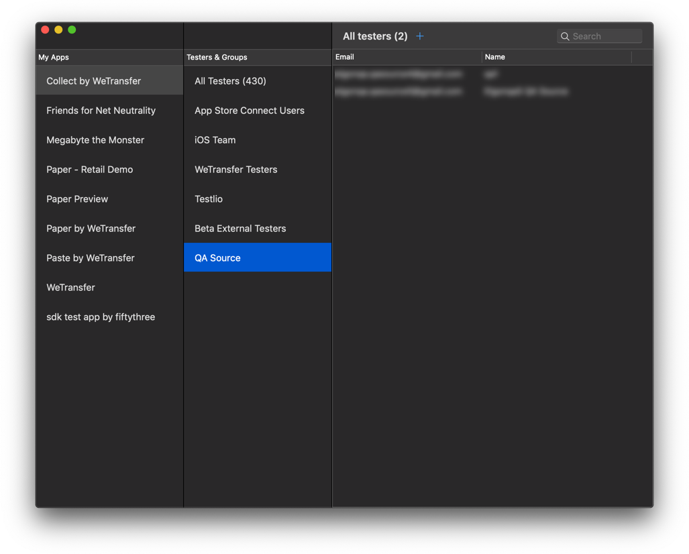

# App Store Connect App
A Mac App to control your App Store Connect account, build using the [App Store Connect Swift SDK](https://github.com/AvdLee/appstoreconnect-swift-sdk).

This currently is work in progress, but hey, it's a start!

 

## Current features

- [x] List all apps
- [x] List all related TestFlight Groups
- [x] List all TestFlight users (filtered by group)
- [x] Add a new user to the selected group
- [x] Search in the current selected TestFlight group
- [ ] More to come!

## Communication

- If you **found a bug**, open an [issue](https://github.com/AvdLee/appstoreconnect-app/issues).
- If you **have a feature request**, open an [issue](https://github.com/AvdLee/appstoreconnect-app/issues).
- If you **want to contribute**, submit a [pull request](https://github.com/AvdLee/appstoreconnect-app/pulls).

## License

**App Store Connect Swift SDK** is available under the GNU General Public license. See the [LICENSE](https://github.com/AvdLee/appstoreconnect-app/blob/master/LICENSE) file for more info.
